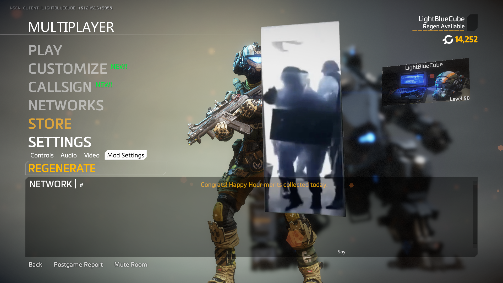

## bink to webm



### Usage

> this is not very stable yet, so not recommended play lots of video

drop the plugin into `R2Northstar/plugins/`

drop your media files into `R2Northstar/media.webm/`

supports codec: `VP8`, `VP9`

color space: `BT.601`, color range: `full (0–255)`

extra command: `playvideoex <filename> <x> <y> <width> <height> <loop> [fade_in]`

## Build (MSYS2)

```sh
pacman -Sy --needed make patch mingw-w64-x86_64-{gcc,cmake,pkgconf,MinHook,nasm}

cmake -S . -B build -G "MinGW Makefiles"
cmake --build build -j
```
